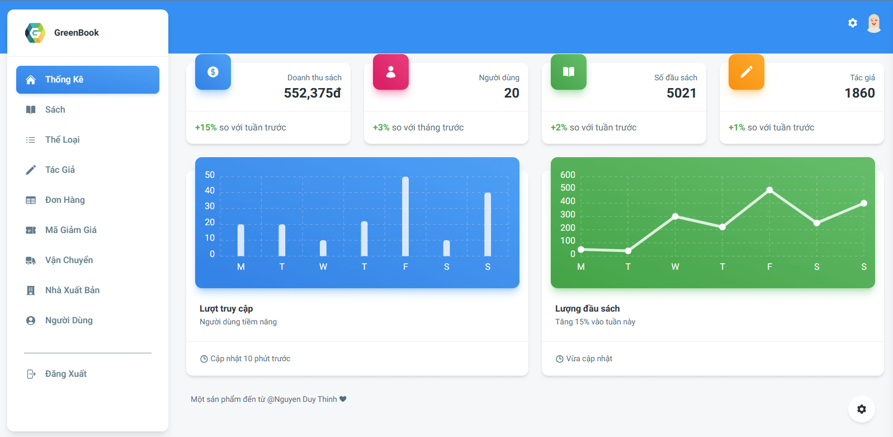
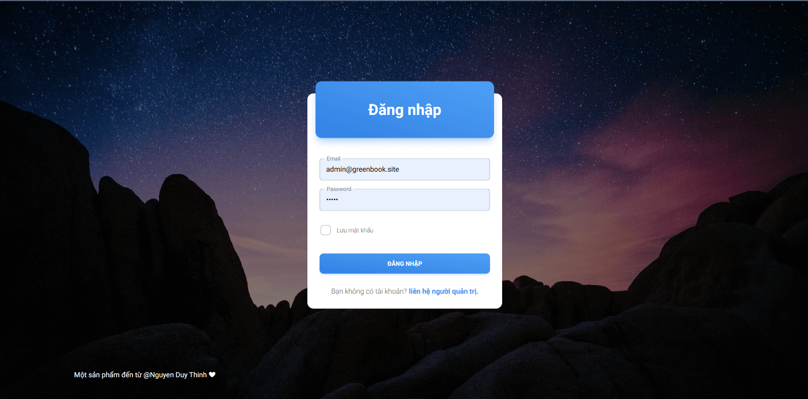
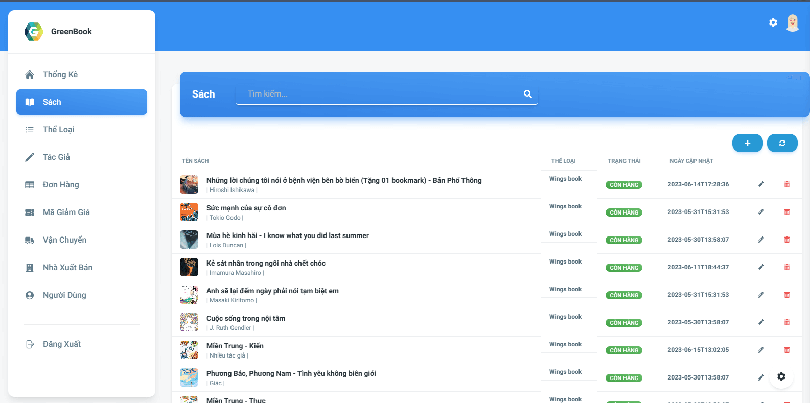
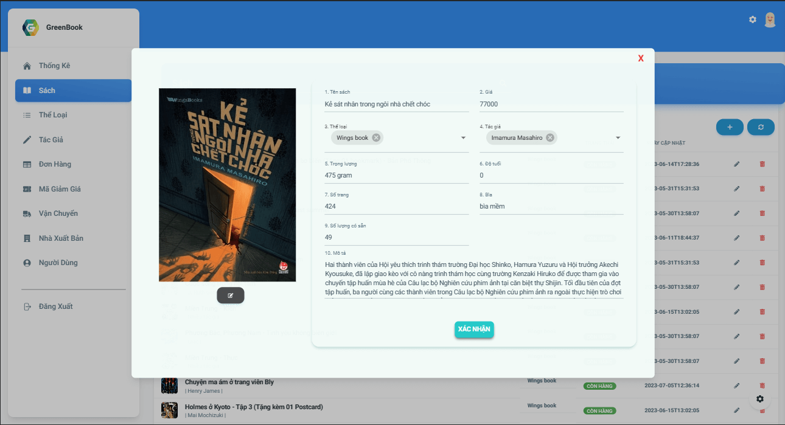
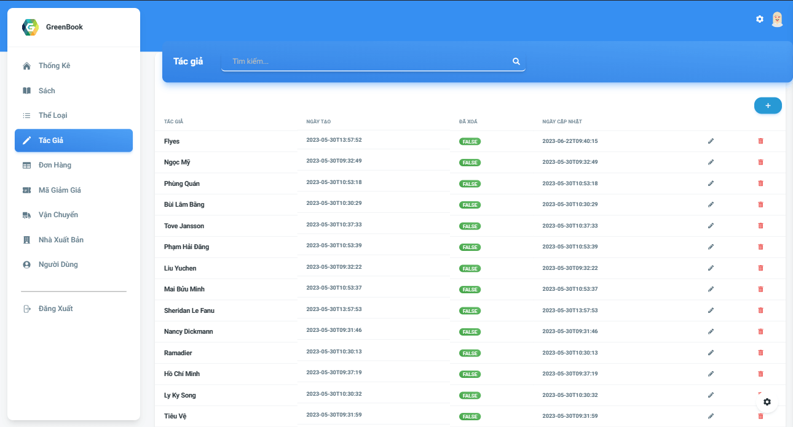
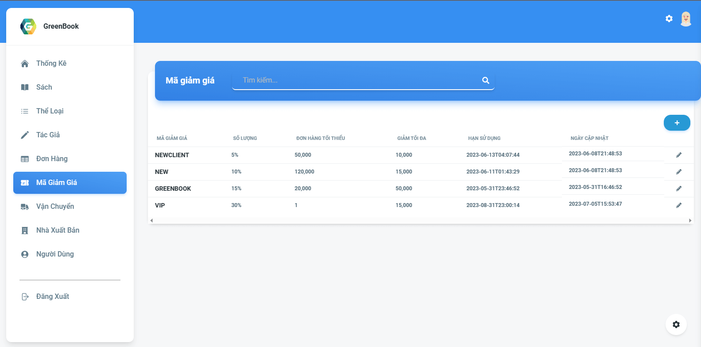
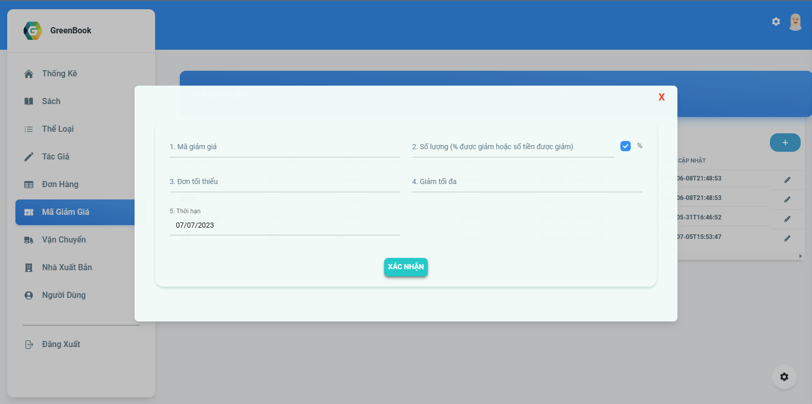
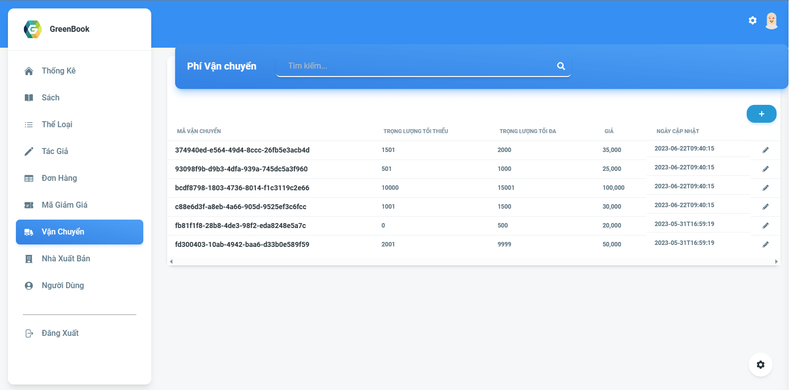
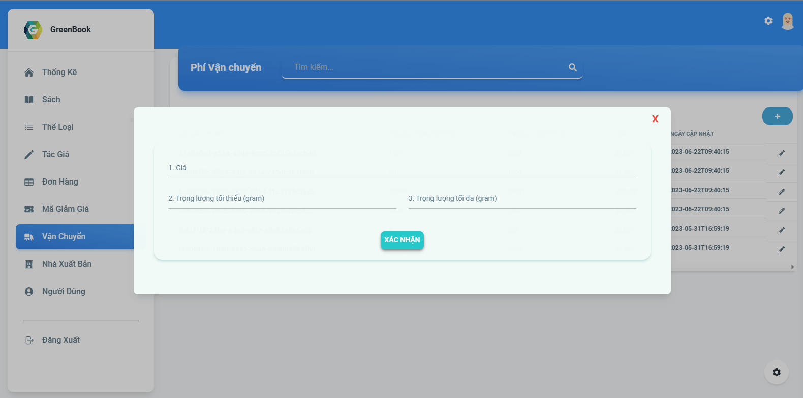

## GreenBook Admin Web

# 💻How to run it

Clone it via the command line "git clone https://gitlab.com/DuyThinh/greenbook-admin.git"

and

### `npm install`

then run

### `npm run dev`

Runs the app in the development mode.\
Open [http://localhost:8080](http://localhost:8080) to view it in your browser.

## 🌐Preview

# Dashboard page

# Auth page

# Books page

# Edit book

# Genres page

# Authors page

# coupons page

# create coupons

# deliveryFees page

# create deliveryFee

## Demo

# `https://greenbook-web.vercel.app/`
